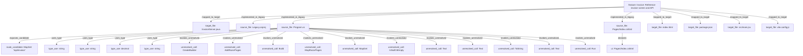

# Application map

Lexical candidates require review; this is not a complete semantic call graph.

```mermaid
flowchart TD
  Nd1d36b37fd77a4684483["target_file: InvoiceServer.java"]
  N0d368e5c48ff79e8c5a6["source_file: Legacy.csproj"]
  Nca7cb35e04aaa2b0292f["source_file: Pages/Index.cshtml"]
  N479cf5547415a024c9e9["ui: Pages/Index.cshtml"]
  N66de074ccb2fcdc50d3d["source_file: Program.cs"]
  N60ed424b5d4e811c7cbe["route_candidate: MapGet '/api/invoice'"]
  N4285f9372b8b2914cb37["type_use: string"]
  Nafa8ff5fc77d9947d5bd["type_use: string"]
  N570b83eff4ac62a363f7["type_use: decimal"]
  N76c2e3521014ecefeb44["type_use: string"]
  Nf5d24f8478d39afd0bdb["target_file: index.html"]
  N8bc2310dd3e4fb926233["target_file: package.json"]
  N9187ef9e1429aa919c34["target_file: src/main.jsx"]
  Nc50fc0a218e9cadbc5b4["target_file: vite.config.js"]
  N33c741f8f03754c1b75f["unresolved_call: CreateBuilder"]
  Nf9dc8b4ccc6d9a34373b["unresolved_call: AddRazorPages"]
  Naa36793259922de8e12d["unresolved_call: Build"]
  Nf0b4c921a149c18dfb28["unresolved_call: MapRazorPages"]
  N9f969a371c11906523db["unresolved_call: MapGet"]
  N9dd6c598bd344fd4a322["unresolved_call: IsNullOrEmpty"]
  N85cfcf9473c01673fc5e["unresolved_call: Text"]
  N8b3ace8077e6ad9aefe4["unresolved_call: Text"]
  N217e22a2e852abf6b1d9["unresolved_call: ToString"]
  N77e7f81404498fa4c21c["unresolved_call: Text"]
  Nc157a8062a45d71b594c["unresolved_call: Run"]
  Nb7eb523c9d893031684a["feature: Invoice: Reference invoice screen and API"]
  Nca7cb35e04aaa2b0292f -->|declares| N479cf5547415a024c9e9
  N66de074ccb2fcdc50d3d -->|exposes_candidate| N60ed424b5d4e811c7cbe
  N66de074ccb2fcdc50d3d -->|uses_type| N4285f9372b8b2914cb37
  N66de074ccb2fcdc50d3d -->|uses_type| Nafa8ff5fc77d9947d5bd
  N66de074ccb2fcdc50d3d -->|uses_type| N570b83eff4ac62a363f7
  N66de074ccb2fcdc50d3d -->|uses_type| N76c2e3521014ecefeb44
  N66de074ccb2fcdc50d3d -->|invokes_unresolved| N33c741f8f03754c1b75f
  N66de074ccb2fcdc50d3d -->|invokes_unresolved| Nf9dc8b4ccc6d9a34373b
  N66de074ccb2fcdc50d3d -->|invokes_unresolved| Naa36793259922de8e12d
  N66de074ccb2fcdc50d3d -->|invokes_unresolved| Nf0b4c921a149c18dfb28
  N66de074ccb2fcdc50d3d -->|invokes_unresolved| N9f969a371c11906523db
  N66de074ccb2fcdc50d3d -->|invokes_unresolved| N9dd6c598bd344fd4a322
  N66de074ccb2fcdc50d3d -->|invokes_unresolved| N85cfcf9473c01673fc5e
  N66de074ccb2fcdc50d3d -->|invokes_unresolved| N8b3ace8077e6ad9aefe4
  N66de074ccb2fcdc50d3d -->|invokes_unresolved| N217e22a2e852abf6b1d9
  N66de074ccb2fcdc50d3d -->|invokes_unresolved| N77e7f81404498fa4c21c
  N66de074ccb2fcdc50d3d -->|invokes_unresolved| Nc157a8062a45d71b594c
  Nb7eb523c9d893031684a -->|implemented_in_legacy| N66de074ccb2fcdc50d3d
  Nb7eb523c9d893031684a -->|implemented_in_legacy| Nca7cb35e04aaa2b0292f
  Nb7eb523c9d893031684a -->|implemented_in_legacy| N0d368e5c48ff79e8c5a6
  Nb7eb523c9d893031684a -->|mapped_to_target| Nd1d36b37fd77a4684483
  Nb7eb523c9d893031684a -->|mapped_to_target| N9187ef9e1429aa919c34
  Nb7eb523c9d893031684a -->|mapped_to_target| N8bc2310dd3e4fb926233
  Nb7eb523c9d893031684a -->|mapped_to_target| Nc50fc0a218e9cadbc5b4
  Nb7eb523c9d893031684a -->|mapped_to_target| Nf5d24f8478d39afd0bdb
```

Showing 26 of 26 nodes. Full data is available from map --format json.
